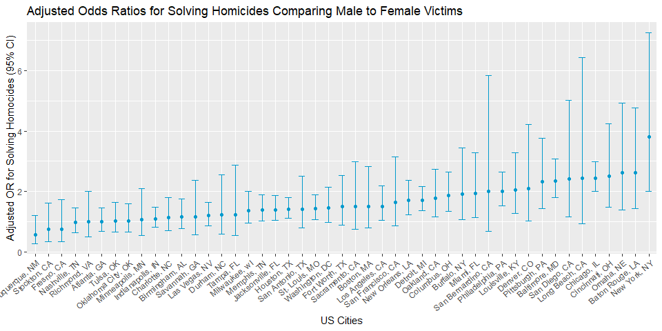
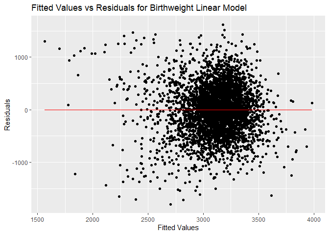
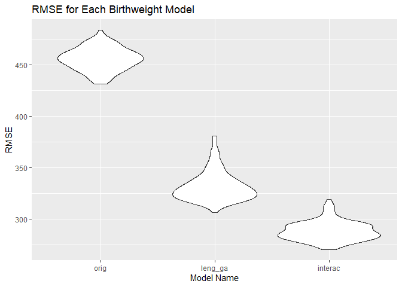

Homework 6
================
Vanessa Dinh
12/1/22

## Problem 2

``` r
url = "https://raw.githubusercontent.com/washingtonpost/data-homicides/master/homicide-data.csv"

raw_wapo_homocide = 
  read_csv(url) %>% 
  janitor::clean_names()
```

    ## Rows: 52179 Columns: 12
    ## ── Column specification ────────────────────────────────────────────────────────
    ## Delimiter: ","
    ## chr (9): uid, victim_last, victim_first, victim_race, victim_age, victim_sex...
    ## dbl (3): reported_date, lat, lon
    ## 
    ## ℹ Use `spec()` to retrieve the full column specification for this data.
    ## ℹ Specify the column types or set `show_col_types = FALSE` to quiet this message.

``` r
wapo_homocide =
  raw_wapo_homocide %>% 
  mutate(
    city_state = paste(city, state, sep = ", "),
    disposition = as.factor(disposition),
    city_state = as.factor(city_state),
    uid = as.factor(uid),
    victim_age = as.numeric(victim_age),
    victim_sex = as.factor(victim_sex),
    resolved_homocide = as.numeric(disposition == "Closed by arrest")
  ) %>% 
  filter(
    city_state != "Dallas, TX" | 
      city_state != "Phoenix, AZ" | 
      city_state != "Kansas City, MO") %>%      
  filter(city_state != "Tulsa, AL") %>% 
  filter(victim_race == "White" | 
           victim_race == "Black") %>% 
  mutate(
    victim_race = fct_relevel(victim_race, "White")
  ) %>% 
  filter(!is.na(victim_age)) %>% 
  filter(victim_sex == "Male" | 
           victim_sex == "Female") %>% 
  mutate(victim_sex = fct_relevel(victim_sex, "Male", "Female")) %>% 
  droplevels() %>% 
  nest_by(city_state)
```

    ## Warning in mask$eval_all_mutate(quo): NAs introduced by coercion

``` r
balti_glm_logistic =
  wapo_homocide %>% 
  filter(city_state == "Baltimore, MD") %>% 
  unnest(data) %>% 
  select(resolved_homocide, victim_age, victim_race, victim_sex) %>% 
  glm(resolved_homocide ~ victim_age + victim_race + victim_sex, data = ., family = binomial()) 
```

    ## Adding missing grouping variables: `city_state`

``` r
balti_glm_logistic %>% 
  broom::tidy() %>% 
  mutate(
     adjusted_OR = exp(estimate),
     estimate_lower_CI = estimate - (1.96*std.error),
     estimate_upper_CI = estimate + (1.96*std.error),
     OR_lower_CI = exp(estimate_lower_CI),
     OR_upper_CI = exp(estimate_upper_CI)) %>% 
  filter(term == "victim_sexFemale") %>% 
  select(term, adjusted_OR, OR_lower_CI, OR_upper_CI) %>% 
  knitr::kable(digits = 3)
```

| term             | adjusted_OR | OR_lower_CI | OR_upper_CI |
|:-----------------|------------:|------------:|------------:|
| victim_sexFemale |        2.35 |       1.793 |       3.081 |

``` r
city_glm = function(x) {
  
  city_glm_df =
  wapo_homocide %>% 
  filter(city_state == x) %>% 
  unnest(data) %>% 
  select(resolved_homocide, victim_age, victim_race, victim_sex) %>% 
  glm(resolved_homocide ~ victim_age + victim_race + victim_sex, data = ., family = binomial()) 
  
  city_glm_df %>% 
  broom::tidy() %>% 
  mutate(
     adjusted_OR = exp(estimate),
     estimate_lower_CI = estimate - (1.96*std.error),
     estimate_upper_CI = estimate + (1.96*std.error),
     OR_lower_CI = exp(estimate_lower_CI),
     OR_upper_CI = exp(estimate_upper_CI)) %>% 
  filter(term == "victim_sexFemale") %>% 
  select(adjusted_OR, OR_lower_CI, OR_upper_CI)
}

final_glm_df = 
  wapo_homocide %>% 
  mutate(summary = map(city_state, city_glm)) %>% 
  select(city_state, summary) %>% 
  unnest(summary)
```

``` r
final_glm_df %>% 
  knitr::kable(digits = 3)
```

| city_state         | adjusted_OR | OR_lower_CI | OR_upper_CI |
|:-------------------|------------:|------------:|------------:|
| Albuquerque, NM    |       0.566 |       0.266 |       1.204 |
| Atlanta, GA        |       1.000 |       0.683 |       1.463 |
| Baltimore, MD      |       2.350 |       1.793 |       3.081 |
| Baton Rouge, LA    |       2.622 |       1.438 |       4.779 |
| Birmingham, AL     |       1.149 |       0.759 |       1.741 |
| Boston, MA         |       1.499 |       0.794 |       2.829 |
| Buffalo, NY        |       1.921 |       1.069 |       3.451 |
| Charlotte, NC      |       1.131 |       0.713 |       1.795 |
| Chicago, IL        |       2.438 |       1.998 |       2.976 |
| Cincinnati, OH     |       2.501 |       1.477 |       4.236 |
| Columbus, OH       |       1.878 |       1.334 |       2.644 |
| Denver, CO         |       2.087 |       1.030 |       4.230 |
| Detroit, MI        |       1.717 |       1.363 |       2.164 |
| Durham, NC         |       1.231 |       0.594 |       2.551 |
| Fort Worth, TX     |       1.495 |       0.887 |       2.519 |
| Fresno, CA         |       0.749 |       0.326 |       1.723 |
| Houston, TX        |       1.406 |       1.103 |       1.793 |
| Indianapolis, IN   |       1.088 |       0.805 |       1.472 |
| Jacksonville, FL   |       1.389 |       1.036 |       1.864 |
| Las Vegas, NV      |       1.194 |       0.867 |       1.646 |
| Long Beach, CA     |       2.438 |       0.924 |       6.430 |
| Los Angeles, CA    |       1.511 |       1.046 |       2.183 |
| Louisville, KY     |       2.039 |       1.266 |       3.282 |
| Memphis, TN        |       1.383 |       1.012 |       1.890 |
| Miami, FL          |       1.941 |       1.147 |       3.284 |
| Milwaukee, wI      |       1.375 |       0.943 |       2.005 |
| Minneapolis, MN    |       1.056 |       0.533 |       2.091 |
| Nashville, TN      |       0.967 |       0.640 |       1.460 |
| New Orleans, LA    |       1.710 |       1.233 |       2.371 |
| New York, NY       |       3.811 |       2.003 |       7.249 |
| Oakland, CA        |       1.776 |       1.151 |       2.739 |
| Oklahoma City, OK  |       1.027 |       0.658 |       1.602 |
| Omaha, NE          |       2.614 |       1.387 |       4.927 |
| Philadelphia, PA   |       2.015 |       1.533 |       2.648 |
| Pittsburgh, PA     |       2.322 |       1.429 |       3.772 |
| Richmond, VA       |       0.994 |       0.492 |       2.008 |
| Sacramento, CA     |       1.495 |       0.748 |       2.988 |
| San Antonio, TX    |       1.419 |       0.801 |       2.515 |
| San Bernardino, CA |       1.999 |       0.684 |       5.841 |
| San Diego, CA      |       2.421 |       1.170 |       5.012 |
| San Francisco, CA  |       1.646 |       0.858 |       3.157 |
| Savannah, GA       |       1.153 |       0.562 |       2.368 |
| St. Louis, MO      |       1.422 |       1.073 |       1.885 |
| Stockton, CA       |       0.740 |       0.340 |       1.610 |
| Tampa, FL          |       1.238 |       0.533 |       2.876 |
| Tulsa, OK          |       1.025 |       0.644 |       1.630 |
| Washington, DC     |       1.447 |       0.982 |       2.132 |

``` r
final_glm_df %>% 
  ggplot(aes(x = reorder(city_state, adjusted_OR), y = adjusted_OR)) +
  geom_point(aes(x = reorder(city_state, adjusted_OR), y = adjusted_OR), color = "deepskyblue3") +
  geom_errorbar(aes(ymin = OR_lower_CI, ymax = OR_upper_CI), color = "deepskyblue3", width = 0.5) +
  labs(
    title = "Adjusted Odds Ratios for Solving Homicides Comparing Male to Female Victims",
    x = "US Cities",
    y = "Adjusted OR for Solving Homocides (95% CI)"
  ) +
  theme(legend.position = "none") +
  scale_x_discrete(
    guide = guide_axis(angle = 40)
  ) 
```


Albuquerque, NM has the lowest adjusted OR for solving homocides
comparing male to female victims while New York, NY has the highest.
Only a few cities have an OR less than 1, meaning there is a higher rate
for solving homocides among males compared to females, however, the 95%
confidence intervals for these cities also includes the null value of 1,
so we conclude that there is no significant difference. New York, NY has
the highest OR and also does not include the null value of 1 in it’s
confidence interval, so there is a significant difference in solved
homocide rates where females have a higher solve rate than males.

## Problem 3

``` r
birthweight_df =
  read_csv("./data/birthweight.csv") %>% 
  janitor::clean_names() %>% 
  mutate(
    babysex = as.factor(babysex),
    bhead = as.numeric(bhead),
    blength = as.numeric(blength),
    bwt = as.numeric(bwt),
    delwt = as.numeric(delwt),
    fincome = as.numeric(fincome),
    frace = as.factor(frace),
    gaweeks = as.numeric(gaweeks),
    malform = as.factor(malform),
    menarche = as.integer(menarche),
    mheight = as.numeric(mheight),
    momage = as.integer(momage),
    mrace = as.factor(mrace),
    parity = as.integer(parity),
    pnumlbw = as.integer(pnumlbw),
    pnumsga = as.integer(pnumsga),
    ppbmi = as.numeric(ppbmi),
    ppwt = as.numeric(ppwt),
    smoken = as.integer(smoken),
    wtgain = as.numeric(wtgain),
    babysex = fct_relevel(babysex, "1"),
    frace = fct_relevel(frace, "1"),
    malform = fct_relevel(malform, "0"),
    mrace = fct_relevel(mrace, "1")
  )
```

    ## Rows: 4342 Columns: 20
    ## ── Column specification ────────────────────────────────────────────────────────
    ## Delimiter: ","
    ## dbl (20): babysex, bhead, blength, bwt, delwt, fincome, frace, gaweeks, malf...
    ## 
    ## ℹ Use `spec()` to retrieve the full column specification for this data.
    ## ℹ Specify the column types or set `show_col_types = FALSE` to quiet this message.

There doesn’t seem to be any missing data in the birthweight dataset
after running a sum(is.na).

Based on a hypothesized theory, I propose a regression model for
birthweight with predictors including length of gestational pregnancy,
mother’s height, and mother’s age at delivery. Since baby birthweight is
a continuous variable, I will fit a linear model with all previously
mentioned predictors as numeric/continuous variables.

``` r
model_bw = 
  birthweight_df %>% 
  lm(bwt ~ gaweeks + mheight + momage, data = .)

model_bw %>% 
  broom::glance()
```

    ## # A tibble: 1 × 12
    ##   r.squared adj.r.…¹ sigma stati…²   p.value    df  logLik    AIC    BIC devia…³
    ##       <dbl>    <dbl> <dbl>   <dbl>     <dbl> <dbl>   <dbl>  <dbl>  <dbl>   <dbl>
    ## 1     0.203    0.202  457.    368. 4.15e-213     3 -32756. 65522. 65554.  9.07e8
    ## # … with 2 more variables: df.residual <int>, nobs <int>, and abbreviated
    ## #   variable names ¹​adj.r.squared, ²​statistic, ³​deviance

``` r
model_bw %>% 
  broom::tidy()
```

    ## # A tibble: 4 × 5
    ##   term        estimate std.error statistic   p.value
    ##   <chr>          <dbl>     <dbl>     <dbl>     <dbl>
    ## 1 (Intercept) -1559.      183.       -8.51 2.39e- 17
    ## 2 gaweeks        63.9       2.22     28.8  2.03e-167
    ## 3 mheight        30.8       2.63     11.7  3.94e- 31
    ## 4 momage          9.71      1.81      5.36 8.84e-  8

``` r
birthweight_df %>% 
  add_predictions(model_bw) %>% 
  add_residuals(model_bw) %>% 
  ggplot(aes(x = pred, y = resid)) +
  geom_point() +
  geom_line(y = 0, color = "red") +
  labs(
    title = "Fitted Values vs Residuals for Birthweight Linear Model",
    x = "Fitted Values",
    y = "Residuals"
  )
```

<!-- -->

### Comparing my Model to Other Models Using Cross-Validation:

Modelling length at birth and gestational age:

``` r
model_leng_ga =
  birthweight_df %>% 
  lm(bwt ~ blength + gaweeks, data = .)

model_leng_ga %>% 
  broom::glance()
```

    ## # A tibble: 1 × 12
    ##   r.squared adj.r.sq…¹ sigma stati…² p.value    df  logLik    AIC    BIC devia…³
    ##       <dbl>      <dbl> <dbl>   <dbl>   <dbl> <dbl>   <dbl>  <dbl>  <dbl>   <dbl>
    ## 1     0.577      0.577  333.   2958.       0     2 -31381. 62771. 62796.  4.82e8
    ## # … with 2 more variables: df.residual <int>, nobs <int>, and abbreviated
    ## #   variable names ¹​adj.r.squared, ²​statistic, ³​deviance

``` r
model_leng_ga %>% 
  broom::tidy()
```

    ## # A tibble: 3 × 5
    ##   term        estimate std.error statistic  p.value
    ##   <chr>          <dbl>     <dbl>     <dbl>    <dbl>
    ## 1 (Intercept)  -4348.      98.0      -44.4 0       
    ## 2 blength        129.       1.99      64.6 0       
    ## 3 gaweeks         27.0      1.72      15.7 2.36e-54

Modelling head circumference, length, sex, and all interactions
(including three-way interactions):

``` r
model_interac =
  birthweight_df %>% 
  lm(bwt ~ bhead * blength * babysex, data = .)

model_interac %>% 
  broom::glance()
```

    ## # A tibble: 1 × 12
    ##   r.squared adj.r.sq…¹ sigma stati…² p.value    df  logLik    AIC    BIC devia…³
    ##       <dbl>      <dbl> <dbl>   <dbl>   <dbl> <dbl>   <dbl>  <dbl>  <dbl>   <dbl>
    ## 1     0.685      0.684  288.   1346.       0     7 -30742. 61501. 61559.  3.59e8
    ## # … with 2 more variables: df.residual <int>, nobs <int>, and abbreviated
    ## #   variable names ¹​adj.r.squared, ²​statistic, ³​deviance

``` r
model_interac %>% 
  broom::tidy()
```

    ## # A tibble: 8 × 5
    ##   term                    estimate std.error statistic      p.value
    ##   <chr>                      <dbl>     <dbl>     <dbl>        <dbl>
    ## 1 (Intercept)            -7177.     1265.       -5.67  0.0000000149
    ## 2 bhead                    182.       38.1       4.78  0.00000184  
    ## 3 blength                  102.       26.2       3.90  0.0000992   
    ## 4 babysex2                6375.     1678.        3.80  0.000147    
    ## 5 bhead:blength             -0.554     0.780    -0.710 0.478       
    ## 6 bhead:babysex2          -198.       51.1      -3.88  0.000105    
    ## 7 blength:babysex2        -124.       35.1      -3.52  0.000429    
    ## 8 bhead:blength:babysex2     3.88      1.06      3.67  0.000245

``` r
bw_cv_df =
  crossv_mc(birthweight_df, 100)
```

``` r
bw_cv_df =
  bw_cv_df %>% 
  mutate(
    orig_mod = map(train, ~lm(bwt ~ gaweeks + mheight + momage, data = .x)),
    leng_ga_mod = map(train, ~lm(bwt ~ blength + gaweeks, data = .)),
    interac_mod = map(train, ~lm(bwt ~ bhead * blength * babysex, data = .))
  ) %>% 
  mutate(
    rmse_orig = map2_dbl(orig_mod, test, ~rmse(model = .x, data = .y)),
    rmse_leng_ga = map2_dbl(leng_ga_mod, test, ~rmse(model = .x, data = .y)),
    rmse_interac = map2_dbl(interac_mod, test, ~rmse(model = .x, data = .y))
    )
```

``` r
bw_cv_df %>%
  select(starts_with("rmse")) %>% 
  pivot_longer(
    everything(),
    names_to = "model",
    values_to = "rmse",
    names_prefix = "rmse_") %>% 
  mutate(model = fct_inorder(model)) %>% 
  ggplot(aes(x = model, y = rmse)) + 
  geom_violin() +
  labs(
    title = "RMSE for Each Birthweight Model",
    x = "Model Name",
    y = "RMSE"
  )
```

<!-- -->
